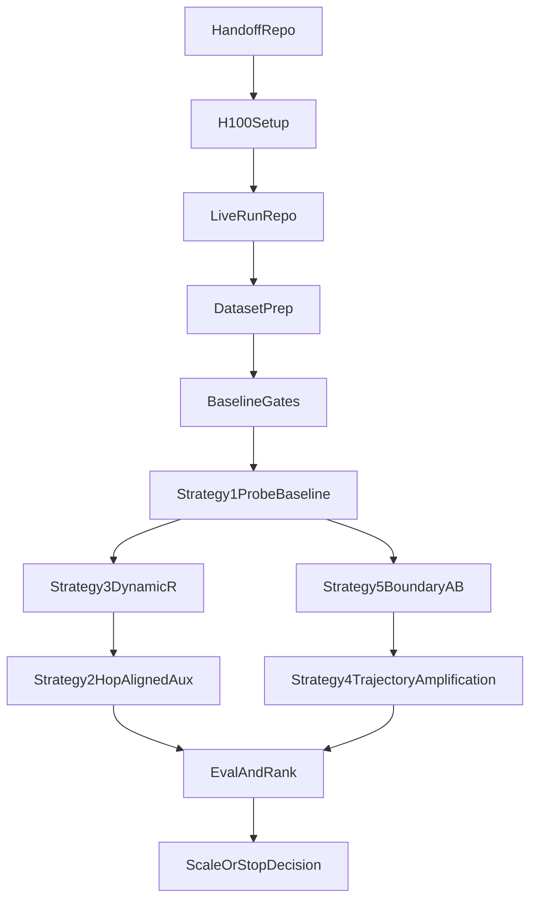

# End-To-End Pipeline

This is the full pipeline the orchestrator is expected to run.

## Step 1: Handoff Repo

Clone and validate this repository first.

Outputs:

- validated strategy matrix
- validated setup docs
- run-repo creation script

## Step 2: Machine Setup

Prepare:

- Python environment
- GPU visibility
- `gh` auth
- Hugging Face auth
- stable cache path

## Step 3: Live Run Repo

Create a separate private run repo.

Why:

- protects the handoff package from run-specific churn
- keeps logs and decisions isolated
- makes frequent push discipline straightforward

## Step 4: Dataset Prep

Prepare and document:

- training corpus
- probe corpus
- benchmark access
- filtering rules
- split logic

## Step 5: Baseline Gates

Run:

- output contract gate
- standard benchmark smoke
- baseline benchmark anchor

No training starts before this phase passes.

## Step 6: Strategy 1 First

Run the natural-language latent probe baseline.

This decides whether the later interpretation is:

- amplify existing latent structure
- or install missing structure

## Step 7: First Parallel Wave

Run the highest decision-efficiency strategies first:

- dynamic recurrence plus curriculum
- boundary-token A/B

## Step 8: Second Parallel Wave

Run:

- hop-aligned auxiliary supervision
- trajectory-classifier amplification

The orchestrator should preserve the strategy-specific gates for each.

## Step 9: Evaluation And Ranking

For each valid variant:

- collect probe evidence
- collect benchmark evidence
- collect depth evidence
- write findings

## Step 10: Next Move

Pick one:

1. scale the strongest strategy
2. rerun the strongest weak-positive at higher budget
3. stop and fix data/measurement
4. escalate to elastic-depth or stable from-scratch looped modeling

